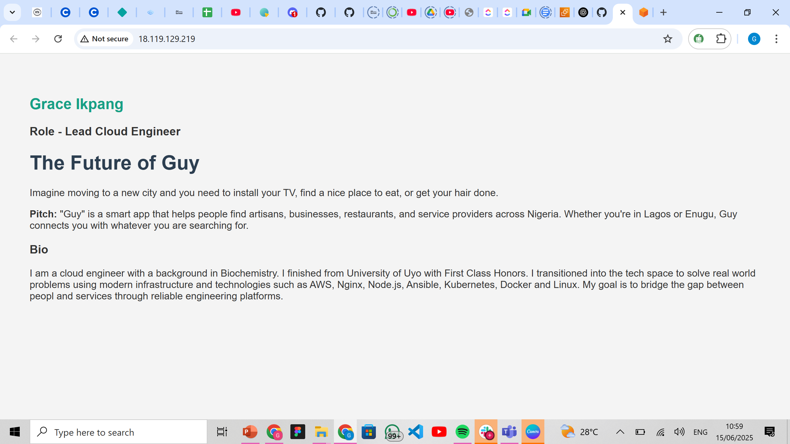

# Guy 

## 🔥 Pitch
Guy is a dynamic mobile application designed to help users discover artisans, services, businesses, and restaurants across different states in Nigeria. It brings convenience, trust, and accessibility to your fingertips.

## 👩🏽‍💻 Bio
I have a degree in Biochemistry, and transitioned into Cloud Engineering to bridge real-world solutions with technical excellence. I’m passionate about deploying scalable infrastructure and solving real problems with cloud-native tools.

## 🚀 Deployed Landing Page
**Public IP:** http://18.119.129.219

## 📦 Tech Stack
- Node.js
- Nginx (reverse proxy)
- Ubuntu 24.04 on AWS EC2
- Git & GitHub for version control

## 🔧 Setup Steps

### 1. Server Provisioning
- Created an EC2 instance on AWS (Ubuntu 24.04)
- Opened ports 80 (HTTP) and 443 (HTTPS)

### 2. Web Server Configuration
- Installed Nginx
- Set up a reverse proxy to route traffic to a Node.js app

### 3. Application Setup
- Built a dynamic landing page using Node.js
- Configured Nginx to forward requests to the Node app

### 4. Deployment
- Connected server to GitHub repo using SSH
- Pushed all project files to GitHub

## 🖼️ Screenshot of Landing Page

